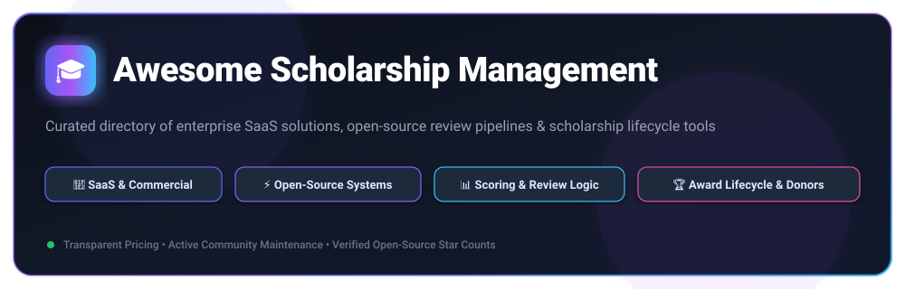

<div align="center">



# 🎓 Awesome Scholarship Management 🚀

### *Curated Directory of SaaS Platforms, Open-Source Pipelines & Evaluation Workflow Systems*

<p align="center">
  <a href="https://github.com/ishandutta2007/Awesome-Awesome-Awesome"></a><a href="https://discord.gg/jc4xtF58Ve"></a>
  <a href="https://github.com/ishandutta2007/Awesome-Scholarship-Management/stargazers"></a>
  <a href="https://github.com/ishandutta2007/Awesome-Scholarship-Management/network/members"></a>
  <a href="https://github.com/ishandutta2007/Awesome-Scholarship-Management/blob/main/LICENSE"></a>
  <a href="https://github.com/ishandutta2007"></a>
</p>

**Last updated: September 2026**

</div>

---

## 📖 Overview & SEO Summary 🔍

Welcome to the definitive, community-maintained ecosystem guide for **Scholarship Management Software (SMS)**, **Grant Lifecycle Management (GLM)**, and **Academic Award Intake Platforms**. 

Whether you represent a higher-education university financial aid department, a philanthropic community foundation, a corporate CSR initiative, or an open-source education project, this repository provides:

- 🏢 **Commercial SaaS Solutions:** In-depth breakdown with transparent entry-level pricing, company valuation/scale, and free trial limits.
- ⚡ **Open-Source Codebases & Frameworks:** GitHub repositories ranked by community adoption and stars with live social badges.
- 📊 **Architecture Blueprints:** Form intake pipelines, dynamic scoring rubrics, multi-stage blind reviewer assignments, and donor outcome stewardship.
- 🛡️ **Compliance & Security:** Standards for FERPA, GDPR, auditability, and fair decision tracking.

---

## 📑 Table of Contents

- [🏢 SaaS & Hosted Commercial Platforms](#-saashosted-commercial-platforms)
  - [📊 Market Dynamics & Industry Size](#-market-dynamics--industry-size)
  - [📋 SaaS Comparison Matrix](#-saas-comparison-matrix)
- [⚡ Open-Source GitHub Projects](#-open-source-github-projects)
  - [⭐ Ranked Repositories by Stars](#-ranked-repositories-by-stars)
  - [🛠️ Architectural Workflow Blueprint](#-architectural-workflow-blueprint)
- [🤝 How to Contribute](#-how-to-contribute)
- [⭐ Star History](#-star-history)
- [⚖️ Disclaimer & Compliance Notice](#-disclaimer--compliance-notice)

---

## 🏢 SaaS/Hosted Commercial Platforms

### 📊 Market Dynamics & Industry Size

> 📈 **Market Size & Industry Landscape:** The global scholarship and grant management software sector is estimated between **$2.05 Billion and $9.5 Billion** (expanding at an **8.5% – 12.6% CAGR** through 2033–2035). The sector is **moderately fragmented**, featuring massive enterprise cloud conglomerates (e.g., Blackbaud, SurveyMonkey) alongside nimble, high-velocity vertical SaaS specialists (e.g., Submittable, AwardSpring, SmarterSelect) rather than a single winner-take-all monopoly.

### 📋 SaaS Comparison Matrix

*(Ranked in descending order by Company Scale / Revenue / Valuation)*

| Platform | Company Scale (Revenue / Valuation) | Description | Pricing (Starting Tier) | Free Tier / Trial Limits |
| :--- | :--- | :--- | :--- | :--- |
| **[Blackbaud Award Management](https://www.blackbaud.com/)** | **$1.13B+ Annual Revenue**<br>*(~$2.14B Market Cap, NASDAQ: BLKB)* | Enterprise higher-education award & scholarship management suite (formerly AcademicWorks) with campus SIS and donor reporting integration. | Starts at approx. **$119/month** (~$1,428/year entry tier); campus deployments typically range **$3,000–$10,000+/year** by fund volume. | **30-day guided evaluation sandbox** for higher-ed institutions upon demo consultation; no permanent free plan. |
| **[SurveyMonkey Apply](https://www.surveymonkey.com/apply/)** | **~$481M Annual Revenue**<br>*(STG Private Equity, $1.5B Valuation)* | Enterprise application intake and review platform (formerly FluidReview) powered by SurveyMonkey's workflow engine for academic grants and scholarships. | Starts at **$4,000/year** (entry base tier for small-scale intake + optional $500–$1,500 setup fee; education & non-profit discounts available). | **14-day guided proof-of-concept sandbox trial** available upon scheduling a demo with sales; no permanent free plan. |
| **[Submittable](https://www.submittable.com/)** | **~$35M–$67M ARR**<br>*(~$998M Est. Valuation, $169M+ Funding)* | Highly flexible submission, review, and grant/scholarship management platform trusted by universities, foundations, and publishers worldwide. | Starts at **$39/month** ($290/year billed annually) for CLMP literary members; standard organizational plans start at **$399/month** (~$3,000–$4,800/year base) + $0.99 + 5% fee on collected applicant fees. | **Free forever for applicants** (unlimited scholarship submissions and file storage); **14-day administrator trial** with access to form builders and review pipeline testing. |
| **[OpenWater](https://www.getopenwater.com/)** | **~$60M–$100M Parent ASI Revenue**<br>*(ASI Group Valuation ~$200M+)* | All-in-one awards, abstract, and scholarship management software with comprehensive review, judging, and program lifecycle controls. | Starts at **$6,900/year** (core awards & scholarship module with 1 TB media storage and reviewer portal; custom domain add-on at $1,200/year). | **14-day guided sandbox trial** with test intake forms, review rubrics, and administrator controls; no permanent free plan. |
| **[Foundant Scholarship Lifecycle](https://www.foundant.com/)** | **~$30M–$50M Annual Revenue**<br>*(Backed by L Squared Capital Partners)* | Specialized scholarship lifecycle manager (SLM) for community foundations and non-profits managing awards from application intake to donor reports. | Starts at **$4,250/year** (Standard tier for foundations and grantmakers; Exponent Philanthropy member discounts available). | **30-day interactive demo sandbox trial** with sample student application pipelines and reviewer evaluation tools; no permanent free plan. |
| **[Scholarship Manager](https://www.nextgenwebsolutions.com/scholarship-manager/)** | **~$5M–$10M Annual Revenue**<br>*(NextGen Web Solutions)* | Institutional scholarship administration solution for donor fund matching, review committee routing, and financial aid disbursement coordination. | Starts at **$2,500/year** (entry institutional tier for collegiate scholarship administration and financial aid disbursement coordination). | **14-day guided test trial** with full access to scholarship matching rules and reviewer scoring sandbox; no permanent free plan. |
| **[AwardSpring](https://www.awardspring.com/)** | **~$3M–$7M Annual Revenue**<br>*(Private SaaS)* | Cloud-based scholarship management platform focused on an intuitive apply–review–award workflow for colleges, universities, and foundations. | Starts at **$99/month** (NOW tier for 1 scholarship; +$29/mo per additional scholarship up to 5) or **$4,500/year** (PRO tier for up to 25 scholarships). | **14-day free trial** with full sandbox access to build application forms and test reviewer scoring workflows; no permanent free plan. |
| **[SmarterSelect](https://www.smarterselect.com/)** | **~$3M–$6M Annual Revenue**<br>*(Private SaaS)* | Configurable application and scholarship management platform featuring flexible dynamic forms, scoring rubrics, and multi-program administration. | Starts at **$2,000/year** (Create tier for standard programs); **$4,000/year** (Enhance tier with advanced evaluation workflows). | **14-day risk-free trial** allowing complete form creation, test submissions, and reviewer evaluation setup with data preserved upon upgrade; no permanent free plan. |
| **[Reviewr](https://www.reviewr.com/)** | **~$2M–$5M Annual Revenue**<br>*(Private SaaS)* | Application and review management platform designed for competitive scholarships, grants, awards, and multi-stage evaluation workflows. | Starts at **$1,500/year** (Basic tier for single-program intake and standard scoring rubrics; Standard/Prestige tiers scale up to $5,000+/year). | **14-day interactive trial sandbox** upon sales registration (sample submission templates and scoring workflows; no permanent free plan). |

---

## ⚡ Open-Source GitHub Projects

### ⭐ Ranked Repositories by Stars

*(Ranked in descending order by GitHub_Stars)*

- **[awesome-computer-science-opportunities](https://github.com/anu0012/awesome-computer-science-opportunities)** [](https://github.com/anu0012/awesome-computer-science-opportunities/stargazers)  
  🌟 Comprehensive curated directory of global scholarship programs, research fellowships, and grant opportunities with eligibility criteria and application deadlines.

- **[Frappe LMS](https://github.com/frappe/lms)** [](https://github.com/frappe/lms/stargazers)  
  🎓 100% open-source higher-education learning and lifecycle management system with extensible enrollment pipelines, user access controls, and evaluation workflows.

- **[nitda-blockchain-scholarship](https://github.com/calistus-igwilo/nitda-blockchain-scholarship)** [](https://github.com/calistus-igwilo/nitda-blockchain-scholarship/stargazers)  
  ⛓️ Open scholarship curriculum and distributed management materials for large-scale national tech scholarship training programs.

- **[GHC-Scholarships](https://github.com/Ladies-Storm-Hackathons/GHC-Scholarships)** [](https://github.com/Ladies-Storm-Hackathons/GHC-Scholarships/stargazers)  
  👩‍💻 Community-maintained repository of corporate, academic, and non-profit conference travel grants and diversity scholarships.

- **[Women-Study-Abroad](https://github.com/Celiashea/Women-Study-Abroad)** [](https://github.com/Celiashea/Women-Study-Abroad/stargazers)  
  🌏 Open-source international scholarship knowledge base and application guidance system for overseas university funding and grants.

- **[awesome-pytorch-scholarship](https://github.com/arnas/awesome-pytorch-scholarship)** [](https://github.com/arnas/awesome-pytorch-scholarship/stargazers)  
  🔥 Curated repository of study tracks, application guidelines, and review strategies for tech challenge scholarships.

- **[Skill-India-AI-ML-Scholarship](https://github.com/AshishJangra27/Skill-India-AI-ML-Scholarship)** [](https://github.com/AshishJangra27/Skill-India-AI-ML-Scholarship/stargazers)  
  🤖 Open repository for national scholarship training cohort track evaluation and project submissions.

- **[one4All](https://github.com/Surajv311/one4All)** [](https://github.com/Surajv311/one4All/stargazers)  
  💻 Curated hub of student grants, open tech scholarships, internships, and educational funding opportunities.

- **[ML-AI-Scholarships](https://github.com/MaryleenAmaizu/ML-AI-Scholarships)** [](https://github.com/MaryleenAmaizu/ML-AI-Scholarships/stargazers)  
  🧠 Curated repository of master's, doctoral, and post-doctoral fellowship grants and scholarships.

- **[Scholarship-Application-Documents](https://github.com/MujtabaFarrukh/Scholarship-Application-Documents)** [](https://github.com/MujtabaFarrukh/Scholarship-Application-Documents/stargazers)  
  📑 Elite Statements of Purpose (SOPs), academic CVs, research proposals, and review rubrics from successful international scholarship applicants.

- **[diversity-index](https://github.com/svaksha/diversity-index)** [](https://github.com/svaksha/diversity-index/stargazers)  
  🌈 Curated diversity index and application repository of STEM grants, scholarships, and academic financial aid.

- **[Wheres-My-Offer](https://github.com/ZE3kr/Wheres-My-Offer)** [](https://github.com/ZE3kr/Wheres-My-Offer/stargazers)  
  📬 University admission and scholarship status tracking portal with notifications and status verification.

- **[College-Hub](https://github.com/shiroonigami23-ui/College-Hub)** [](https://github.com/shiroonigami23-ui/College-Hub/stargazers)  
  🏫 Next.js + FastAPI institutional portal template with student admissions, scholarship notices, and application document processing.

- **[SportsSphere](https://github.com/nikhilij/SportsSphere)** [](https://github.com/nikhilij/SportsSphere/stargazers)  
  ⚽ Full-stack Node.js + PostgreSQL platform supporting athlete scholarship applications, eligibility management, and fund distribution.

- **[scholarship-management](https://github.com/eftakhairul/scholarship-management)** [](https://github.com/eftakhairul/scholarship-management/stargazers)  
  🎯 University scholarship management web application for student applications, committee reviews, and award approvals.

- **[Blockchain-based-National-Scholarship-Portal](https://github.com/LifnaJos/Blockchain-based-National-Scholarship-Portal)** [](https://github.com/LifnaJos/Blockchain-based-National-Scholarship-Portal/stargazers)  
  🔐 Decentralized, tamper-proof scholarship management architecture designed for transparent student verification and anti-fraud distribution.

- **[ScholarshipEvaluationManagementSystem](https://github.com/zongjixiaoai66/ScholarshipEvaluationManagementSystem)** [](https://github.com/zongjixiaoai66/ScholarshipEvaluationManagementSystem/stargazers)  
  📊 Full-stack Vue.js + Spring Boot academic evaluation and scholarship rating system featuring multi-role access for administrators, reviewers, and students.

- **[ScholarSphere](https://github.com/sasindumal/ScholarSphere)** [](https://github.com/sasindumal/ScholarSphere/stargazers)  
  🌐 Open-source scholarship intake and evaluation software connecting applicants, review coordinators, and program administrators with Stripe payments.

- **[scholarship-system](https://github.com/jotpalch/scholarship-system)** [](https://github.com/jotpalch/scholarship-system/stargazers)  
  ⚡ FastAPI and Next.js configuration-driven scholarship application platform with multi-tier role permissions and audit observability.

- **[ScholarTrack](https://github.com/Eztosin/ScholarTrack)** [](https://github.com/Eztosin/ScholarTrack/stargazers)  
  🔮 Modern glassmorphism dashboard for applicant discovery, deadline tracking, and automated scholarship pipeline management.

---

### 🛠️ Architectural Workflow Blueprint

When constructing or self-hosting an in-house scholarship or application evaluation system, open architectures typically implement this five-stage pipeline:

```text
┌────────────────────────┐     ┌────────────────────────┐     ┌────────────────────────┐
│ 1. Intake & Eligibility│ ──> │ 2. Committee Evaluation│ ──> │ 3. Selection & Scoring │
│  • Dynamic Web Forms   │     │  • Blind Rubric Review │     │  • Weighted Matrices   │
│  • Document Transcripts│     │  • Multi-Tier Panels   │     │  • Fund Matching Logic │
└────────────────────────┘     └────────────────────────┘     └────────────────────────┘
                                                                           │
                                                                           ▼
┌────────────────────────┐     ┌────────────────────────┐     ┌────────────────────────┐
│ 6. Outcome Stewardship │ <── │ 5. Award Disbursement  │ <── │ 4. Decision & Notice   │
│  • Impact Reports      │     │  • SIS / ERP Sync      │     │  • Automated Letters   │
│  • Donor Thank-Yous    │     │  • Direct Fund Release │     │  • Offer Confirmations │
└────────────────────────┘     └────────────────────────┘     └────────────────────────┘
```

---

## 🤝 How to Contribute

Contributions are warmly encouraged! Help keep this directory accurate, transparent, and comprehensive:

1. 🍴 **Fork the repository.**
2. 📝 **Add or update an entry** in `README.md` maintaining the existing schema:
   - *For SaaS:* Platform name, company valuation/revenue scale, core focus, starting pricing tier, and free tier / trial limits.
   - *For Open-Source:* Repository name, social star badge with link to `/stargazers`, and a concise description.
3. 🚀 **Submit a Pull Request (PR)** with a clear summary of your changes.

---

## ⭐ Star History

[](https://star-history.dera.page/#ishandutta2007/Awesome-Scholarship-Management&type=date&legend=top-left)

---

## ⚖️ Disclaimer & Compliance Notice

- 🔍 This repository is a **community-curated index** created for educational and administrative evaluation purposes.
- 🛡️ **Data Privacy & Regulatory Standards:** Scholarship and financial aid portals process sensitive personal, academic, and financial information. Deployments must adhere to strict regulatory standards including **FERPA** (Family Educational Rights and Privacy Act), **GDPR**, accessibility guidelines (**WCAG 2.1 AA**), and data encryption protocols at rest and in transit.
- ⚖️ Inclusion does not constitute a commercial endorsement or legal advisory. Always review formal service level agreements (SLAs) with vendors before production deployment.

---

<div align="center">
  <b>Built with ❤️ for scholarship administrators, academic foundations, university teams, and students worldwide.</b>
</div>

